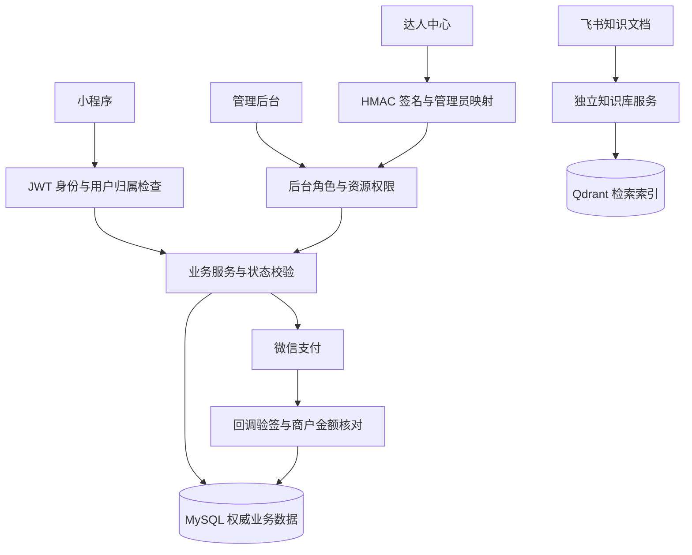

# 逸享荟当前架构与开发契约

核对日期：2026-09-05。本文以仓库依赖、源码和生产结构快照为准。
早期详细设计是历史需求输入，不能作为某个功能已实现、已部署或已验收的证明。

## 模块与事实

| 模块 | 实现与职责 |
| --- | --- |
| `shop-mnp` | uni-app / Vue 2 微信小程序：旅居、云南好物、活动、芳华学院、下单及优惠券 |
| `ruoyi-ui` | Vue 2.6 / Element UI 管理端 |
| `lankong-admin` | Spring MVC 控制器、微信身份入口、达人中心 HMAC 认证入口 |
| `ruoyi-system` | 商品、订单、支付、库存、优惠券、内容及经营数据服务，MyBatis Mapper |
| `ruoyi-framework` | Spring Security、JWT/Redis 会话、数据权限、审计 |
| `ruoyi-common` | 通用实体、异常、文件处理及基础工具 |
| `ruoyi-quartz` | 后台任务，包括未支付订单清理 |
| `knowledge-service` | 独立 Node.js 服务：飞书文档来源、Azure 嵌入/重排、Qdrant 检索 |

根 `pom.xml` 的 Spring Boot 版本为 **2.5.15**，Spring Framework 为 5.3.39，
Spring Security 为 5.7.12，Java 编译目标为 8；本轮测试使用 JDK 11。
数据库为 MySQL，缓存为 Redis。业务主体使用 MyBatis XML Mapper；
`ruoyi-common` 还引入了 MyBatis-Plus，购物车使用其 BaseMapper。
仓库没有 RabbitMQ 实现，本轮也没有测得 500 QPS 容量。

## 核心数据流

订单及经营管理以后台数据为准；新订单不向飞书预订表同步。
飞书历史导入记录、知识文档读取与实时订单同步是不同用途，不能混淆。
活动报名仍存储在 `app_activity_order`，小程序订单中心通过映射合并展示，
并没有迁入商品订单表。

## 必须保持的实现契约

1. 新商品订单仅复制购买意图。主键、支付/履约状态、金额和分销归因不能由请求指定。
   `NewGoodsOrderPolicy` 负责此边界，商品信息重新从数据库读取。
2. 云南好物按界面展示的普通售价计价；旅居按所属商品的房型/套餐及实际入住晚数计价。
   供餐人数不得为负，规格必须属于当前商品并在有效期内。
3. 商品和活动的商户单号分别为 `20 + orderId`、`30 + orderId`；
   已有订单重试支付保持原单号。历史订单保留原单号。
4. 优惠券核销属于下单事务。全额抵扣订单由后台确认零实付，收银台读取已支付状态后进入订单页。
   未支付订单关闭后返还普通券和渠道券。
5. 支付回调使用直连商户交易模型，验证 AppID、商户号、人民币总额与支付日志一致。
   订单更新后才写支付日志成功标记；已关闭订单收到支付成功事件必须暴露对账异常。
6. 普通用户只能读取和操作自己的地址、订单、购物车。
   上传接口需要登录；审计请求和响应都排除微信标识、会话令牌与支付签名。
7. 达人中心写入由签名身份、管理员映射、后台权限、二次确认编号、
   CAS、幂等记录和审计共同约束。管理员 HMAC 不是普通后台登录 Token。
8. App 启动的数值 `scene` 是微信场景码；邀请人只从页面查询参数解析。
   渠道弹券按用户和渠道区分；网络失败保留渠道，访客可从首页进入登录领券流程。
9. 知识库令牌按过期时间刷新；目录/正文缺失是错误而非“空数据”。
   标题变化需要更新索引，外部请求必须有超时。

## 事务与上线门槛

生产结构快照仍存在 MyISAM 表，尤其是库存、订单明细、活动和支付日志；
因此不能仅凭 `@Transactional` 声明“事务已经可靠”。
`sql/commerce_transaction_engines.sql` 给出了 11 张表的迁移与检查语句，
**尚未在生产执行**。需要完整备份、维护窗口、空间检查及逐条执行后的回读。
DDL 会隐式提交，不具备整份脚本回滚能力。

引擎统一后仍需验证支付与关单并发、重复回调、退款重试、活动余量竞争，
并完成真机的下单、领券、支付和退款流程。故障对账处理和退款并发路径仍有技术债，
详见本次审查记录，不能将单元测试替代资金流程验收。

## 验证与发布

- 后端：在 JDK 11 环境执行 `mvn test`。
- 知识库：`node --test knowledge-service/*.test.mjs`。
- 小程序：`e2e/miniprogram` 含源码契约、逻辑测试和依赖微信开发者工具的测试。
  真机/模拟器测试必须先确认目标项目及 API 环境；失败或环境不匹配不算通过。
- 管理端：在 `ruoyi-ui` 执行 `npm run build:prod`。
- 小程序编译、上传开发版、设置体验版、提交审核、正式发布是独立步骤。
  URL Link 的版本参数在微信内存在限制，HTTP 200 不能证明进入了体验版或弹券成功。
