# 逸享荟康养小程序使用指南

看旅居、报活动、选课程，跟着图片一步步操作。

适用界面：1.0.17｜更新日期：2026 年 9 月 9 日｜截图来自小程序模拟器，手机显示可能略有差异

> 图片中的红色箭头指向操作位置，编号对应图旁说明。截图里的价格、活动日期、名额和二维码仅用于说明，请以小程序实时页面为准。为保护个人隐私，订单、预约和优惠券使用入口截图，不展示个人记录。

## 快速找到您需要的内容

- [第一次打开与登录](#第一次打开与登录)
- [认识首页和底部导航](#认识首页和底部导航)
- [搜索旅居、活动和课程](#搜索旅居活动和课程)
- [全国旅居：查基地、选房、预订](#全国旅居查基地选房预订)
- [聚会活动：查看与报名](#聚会活动查看与报名)
- [报名后找预约和活动老师](#报名后找预约和活动老师)
- [芳华学院：选课与报名](#芳华学院选课与报名)
- [查看订单、继续支付与售后](#查看订单继续支付与售后)
- [领取、查看和使用优惠券](#领取查看和使用优惠券)
- [收藏与分享](#收藏与分享)
- [签到领金币](#签到领金币)
- [联系客服与添加管家](#联系客服与添加管家)
- [个人资料与收货地址](#个人资料与收货地址)
- [云南好物的当前状态](#云南好物的当前状态)
- [常见问题 FAQ](#常见问题-faq)

## 第一次打开与登录

1. 在微信里打开朋友分享的小程序卡片，或使用微信“扫一扫”扫描有效的小程序码。
2. 也可以在微信的小程序搜索中输入“逸享荟”，核对名称和标识后打开。界面标识可参考下图。
3. 点击底部“我的”，再点击顶部“登录/注册”。浏览公开内容通常不需要先登录；查看个人记录、收藏、报名或下单时，需要登录。

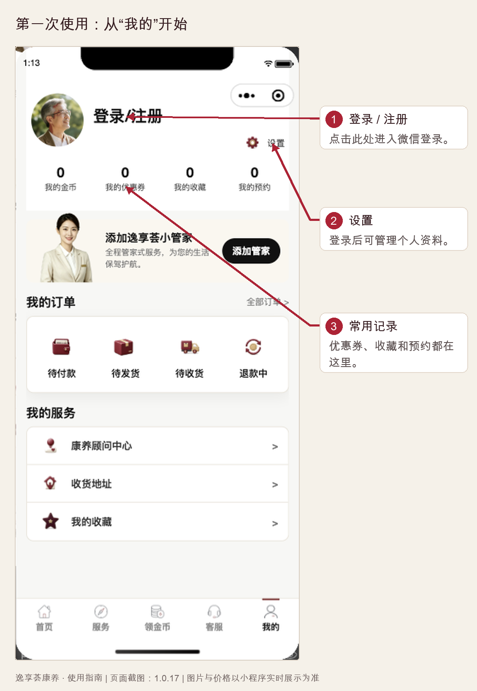

4. 阅读《用户协议》和《隐私政策》，同意后勾选，再点击“微信登录”。如果先出现“微信授权登录”页面，点击其中的“微信登录”进入下一步。
5. 首次使用时，按提示分别选择头像、确认昵称；已有完整资料的账号可能直接完成登录。
6. 若出现手机号授权页，可选择“授权手机号”或“暂不授权”。暂不授权不等于不能登录，但报名、预订时仍需填写有效联系电话。

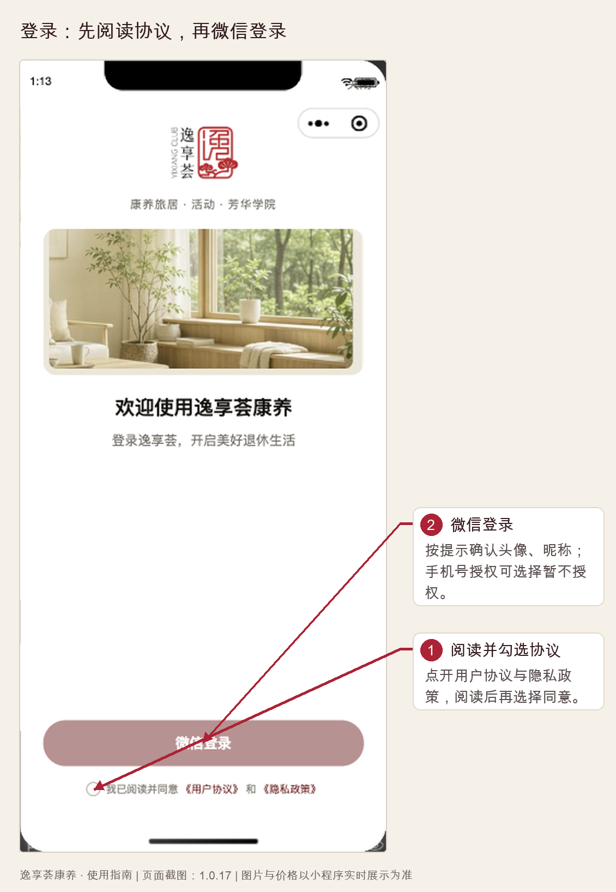

## 认识首页和底部导航

首页可以直接进入各个服务栏目。上方推荐横幅会轮播，点击可打开对应的详情；向下滑动还能查看热门城市和精选推荐。

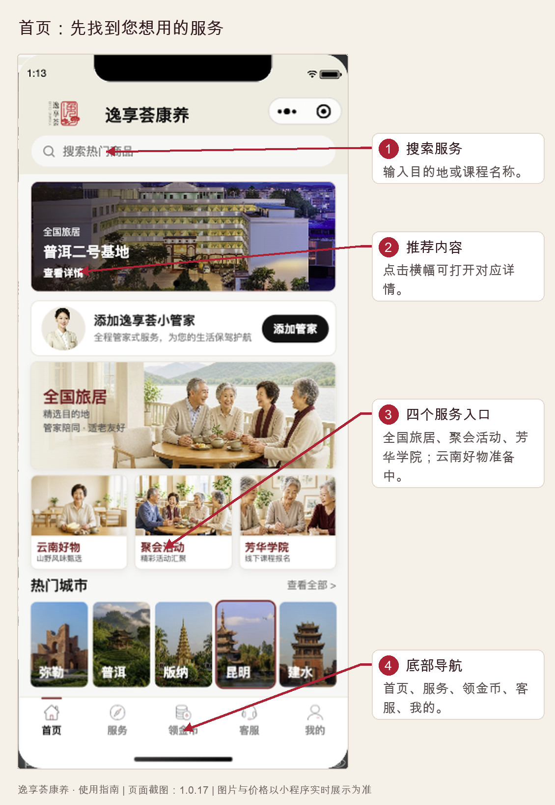

| 底部入口 | 可以做什么 |
| --- | --- |
| 首页 | 看推荐、找服务、添加管家 |
| 服务 | 按栏目和分类浏览旅居、活动、课程 |
| 领金币 | 查看签到奖励及金币任务 |
| 客服 | 查看在线时间、进入群聊、添加客服微信 |
| 我的 | 查看订单、预约、优惠券、收藏及个人设置 |

**返回上一页：** 点击左上角返回箭头。内容较长时，在页面中向上滑动继续阅读。

## 搜索旅居、活动和课程

1. 点击首页顶部搜索框。
2. 输入目的地、基地、活动或课程名称，例如“腾冲”。关键词尽量简短。
3. 点击“搜索”，查看对应类别下的结果。
4. 点击结果卡片或“查看详情”。搜索历史也可以点击再次使用。

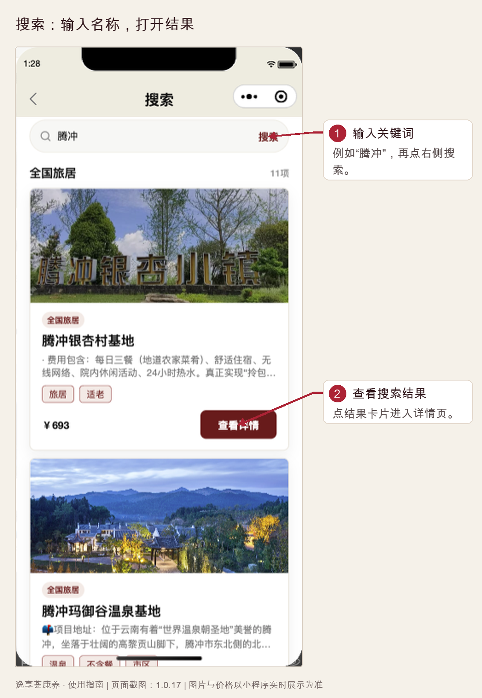

## 全国旅居：查基地、选房、预订

### 1. 选择目的地和基地

点击首页“全国旅居”，或进入“服务 → 全国旅居”。选择左侧城市，再点基地卡片的“查看详情”。

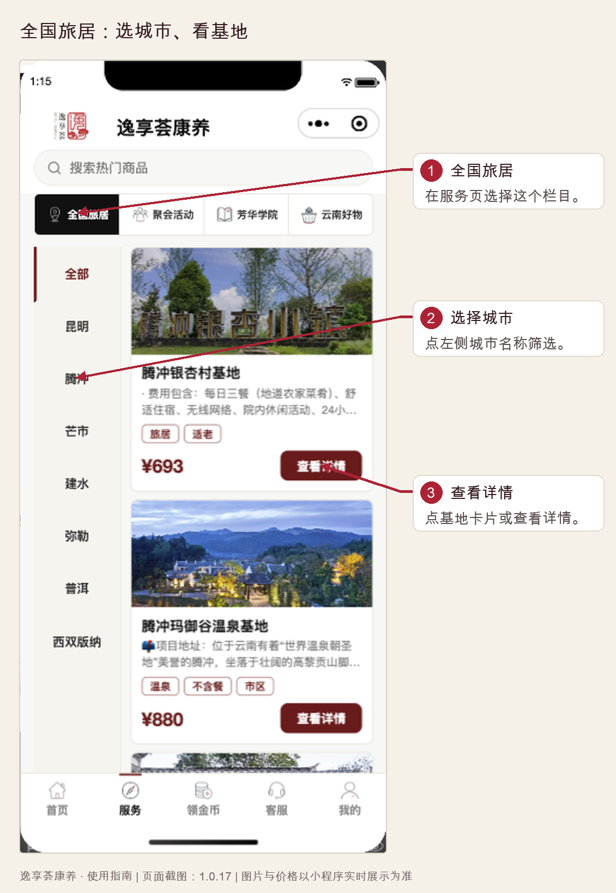

### 2. 阅读介绍和入住要求

查看基地介绍、图片、费用说明和“入住须知”。感兴趣的基地可以先收藏；需要确认交通、供餐或入住安排时，先点“联系客服”。确认后点击底部“查看房源”。

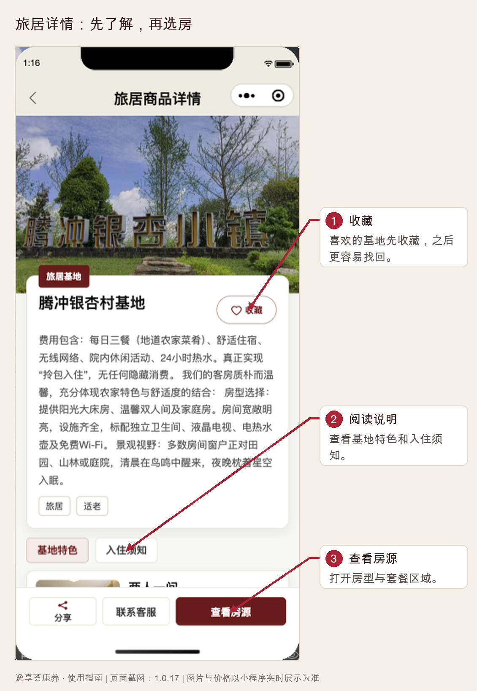

### 3. 选择房型、套餐和日期

1. 核对房型，例如“两人一间”或“一人一间”。
2. 选择套餐，例如“8天7晚”。看清“每人”“每晚”等计价单位，不要把平均每晚价当作整段住宿总价。
3. 点击套餐旁边的“订”。

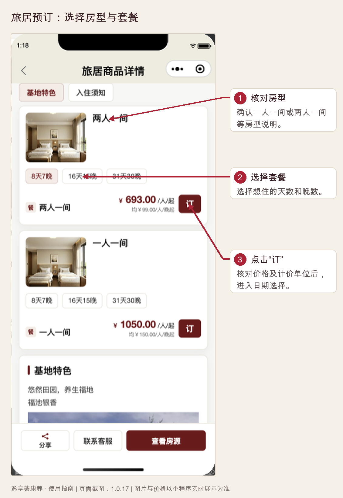

4. 在日期面板选择入住时长和入住日期，核对自动计算的退房日期。
5. 如提供“自选晚数”，按页面允许的范围选择；不支持时，请使用已有套餐。
6. 点击“确认×天×晚”。需要时先完成登录，再继续预订。

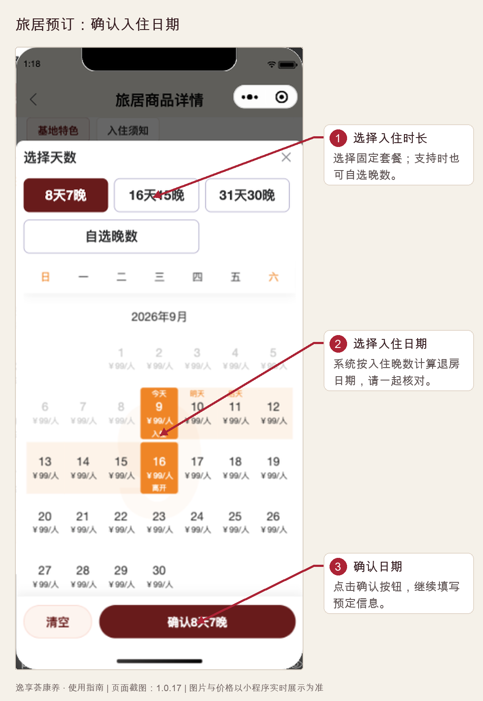

### 4. 填写预定信息并付款

1. 核对入住、退房日期，选择页面提供的供餐方案。
2. 填写房间数量、用餐人数、联系姓名和联系电话。人数与房间限制以页面提示为准。
3. 阅读《预订及入住须知》，同意后勾选。
4. 打开“费用明细”，确认房费、餐费和应付总额，再点击“去付款”。
5. 在收银台核对订单信息，通过微信支付完成付款。
6. 回到“我的 → 全部订单”，确认订单显示已付款，并按约定联系管家确认入住安排。

## 聚会活动：查看与报名

### 1. 查看可报名活动

进入“服务 → 聚会活动”，选择“全部”或相应城市分类。若显示“暂无活动”，可切换分类或稍后再查看。

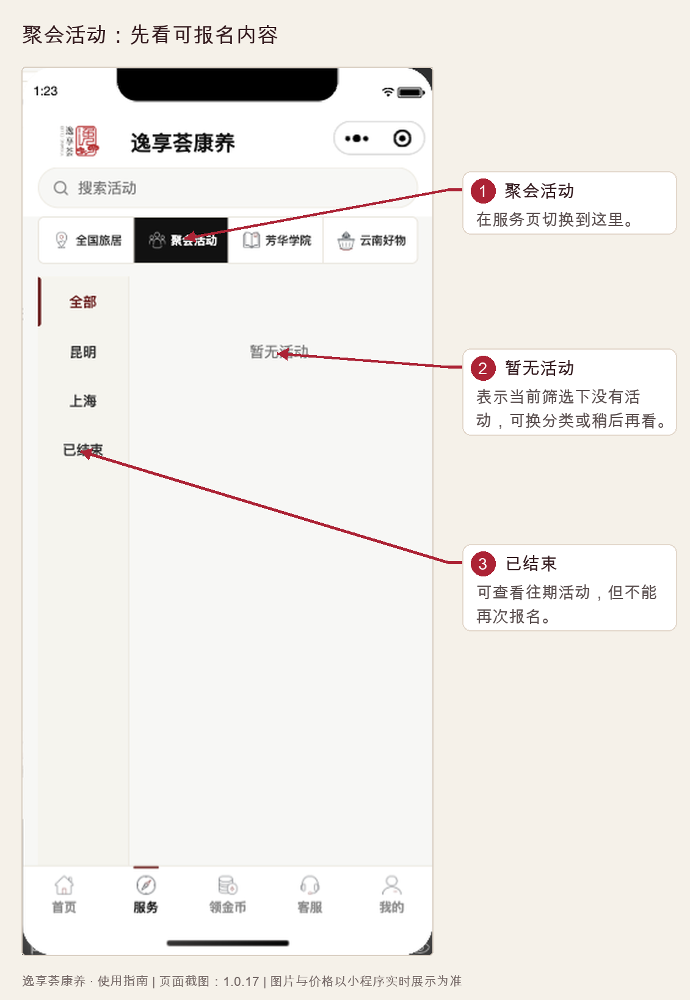

“已结束”中可以查看往期活动。下图是历史记录，不表示这些活动现在仍可报名。

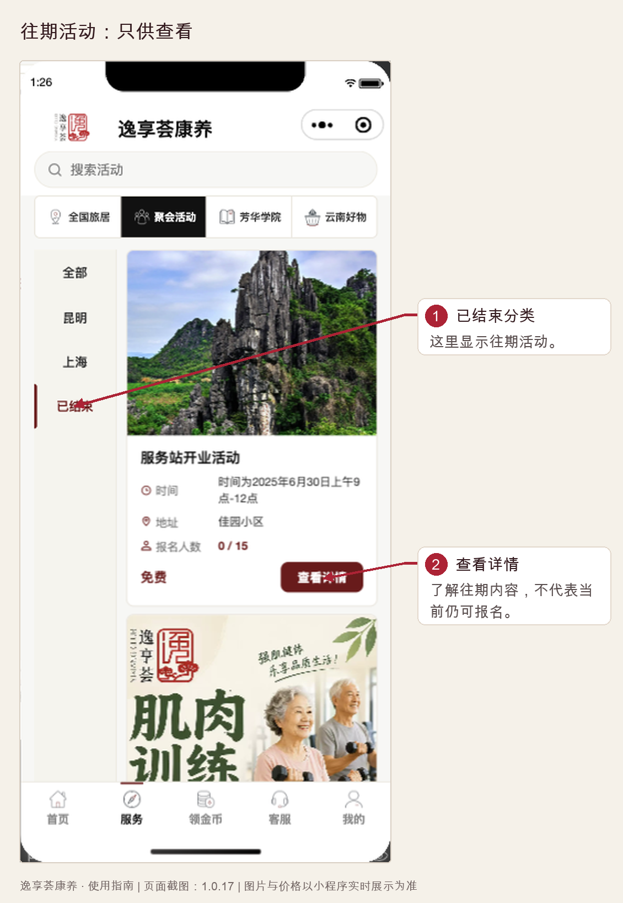

### 2. 阅读活动详情

点开活动，核对状态、时间、地点、报名截止时间、人数和费用。地址旁若有“导航”，可点击打开地图；首次使用按微信提示处理定位权限。

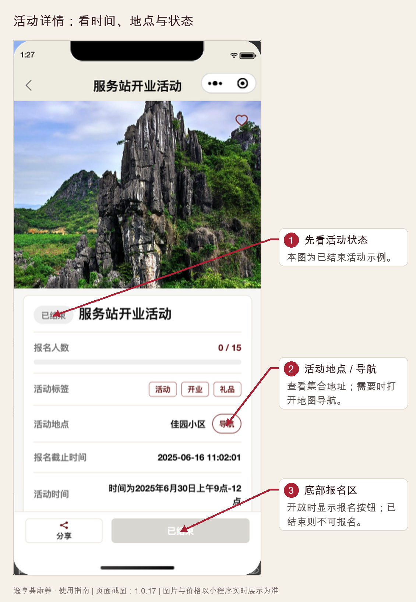

### 3. 按活动类型完成报名

- **免费活动：** 在开放报名时点击“立即报名”，在确认框输入报名人数，再点“确定报名”。请等待报名成功结果。
- **付费活动：** 点击“立即报名”，填写联系人、联系电话、参与人数及选填备注；阅读并勾选《活动报名须知》，核对应付金额，点击“提交报名”，再完成微信支付。
- **已结束、报名截止或名额不足：** 按页面提示处理，不能通过反复点击获得名额。

## 报名后找预约和活动老师

活动报名成功后，会提示“扫码加齐齐老师”。可点击二维码放大，长按识别；若无法直接识别，可保存图片，再到微信“扫一扫”从相册选择。

关闭弹窗后也能找回：

1. 点击底部“我的”。
2. 点击顶部“我的预约”。
3. 选择对应活动，进入预约详情。
4. 查看活动时间、地点、参与人数和报名状态；成功的活动预约内可再次查看老师二维码。
5. 若页面提供“预约修改”，可按允许的字段修改联系人等信息，并点击“保存修改”。付费且已支付的预约，参与人数可能锁定，调整前请先咨询客服。

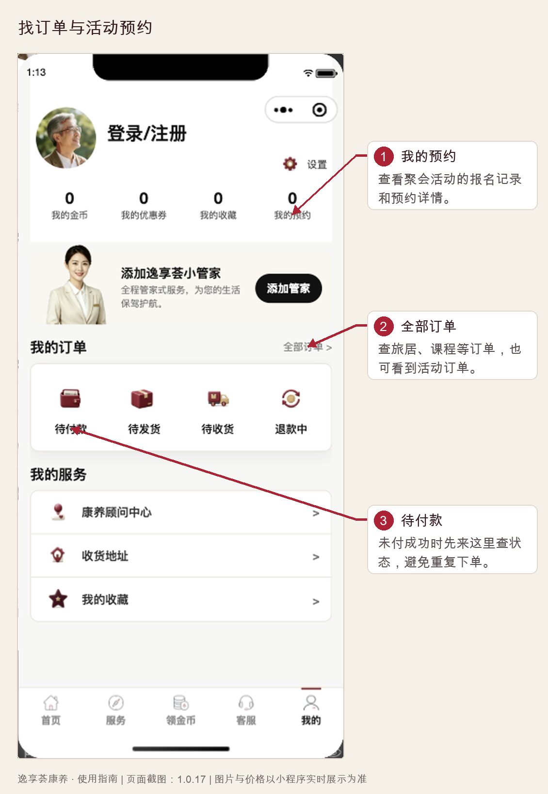

**不是每次打开都弹窗。** 正常再次查看预约时，二维码显示在详情里，不需要重复弹出报名成功提示。待支付、已取消、退款中或已退款的预约，不应当作报名成功。

## 芳华学院：选课与报名

1. 点击首页“芳华学院”，或进入“服务 → 芳华学院”。
2. 按书画艺术、摄影数码、音乐器乐、健康运动等分类找课程。
3. 点击“查看课程”。

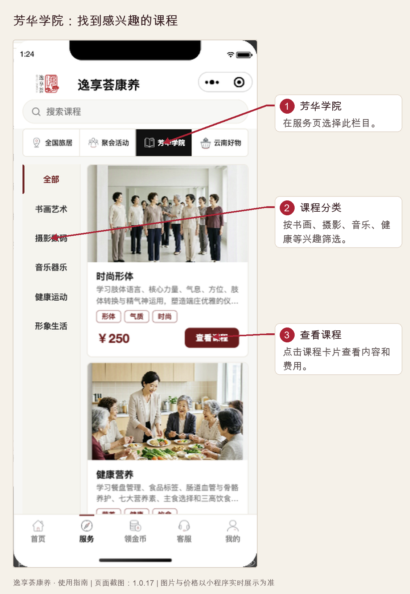

4. 核对报名状态、上课时间、授课地点、老师、学费、课程规格和材料备注。有疑问可点底部“咨询电话”。
5. 在开放报名时点击“立即报名”，填写联系姓名、联系电话及选填留言。
6. 阅读《报名须知》，同意后勾选，核对费用后去付款。
7. 支付后到“我的 → 全部订单”查看课程报名订单。聚会活动的“我的预约”不是课程订单的主要查看入口。

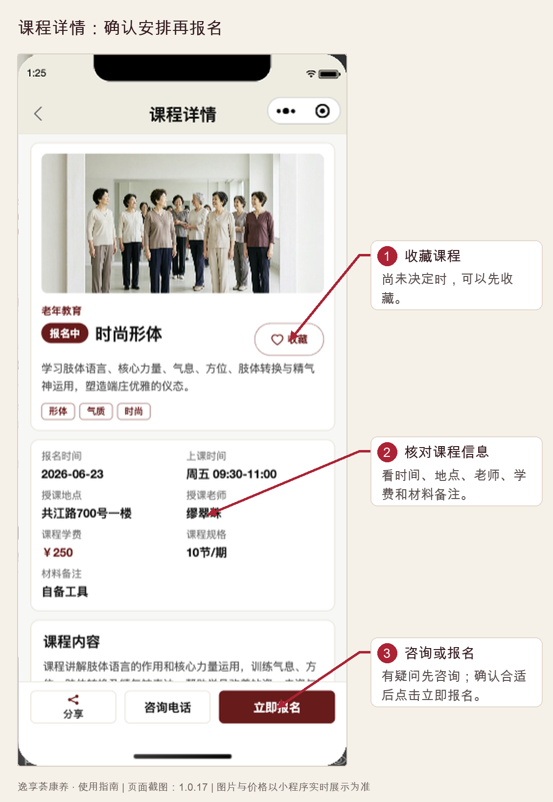

## 查看订单、继续支付与售后

入口：**我的 → 我的订单 → 全部订单**，位置见前面的“我的预约与全部订单”截图。

| 想查什么 | 去哪里、如何操作 |
| --- | --- |
| 旅居预订或课程报名 | “全部订单”中找到对应项目，点开详情 |
| 聚会活动报名 | 优先到“我的预约”；也可在全部订单中查活动订单 |
| 尚未付款的订单 | 点击“待付款”，核对后点击“去支付” |
| 退款进度 | 查看对应订单或预约的状态，留意“退款中”“已退款” |

**支付中断或取消：** 先查看原订单状态。确实未付款且订单仍有效时，再继续支付；已过期或已取消的订单按页面提示重新操作。若微信已扣款但订单尚未更新，先退出详情重新进入核对，不要立即重复付款。

**取消与售后：** 待付款订单可在提供取消操作的位置处理；已付款订单如有“申请售后”，按提示填写原因并提交。活动预约若显示“取消预约”，先仔细阅读确认提示，付费预约可能进入退款流程。是否可退、金额及到账时间，以订单规则和处理结果为准；没有相应按钮时请联系客服。

## 领取、查看和使用优惠券

### 领取专属优惠

通过合作方指定的小程序入口进入时，符合条件会出现专属领券提示。未登录时可能先显示“登录查看优惠”；登录后阅读券的面额、门槛、适用范围和有效期，再点“立即领取”。普通打开小程序不保证出现领券弹窗，同一张已领取的专属券通常不会再次提示领取。

### 查看和使用

1. 进入“我的 → 我的优惠券”。
2. 查看“未使用”“已使用”“已失效”三个分类。
3. 点开阅读券说明，特别留意最低消费金额、有效期和“仅限指定商品 / 仅限指定分类”等限制。
4. 对可用券点击“立即使用”，查看适用内容。下单前再核对结算中的优惠与最终应付金额。

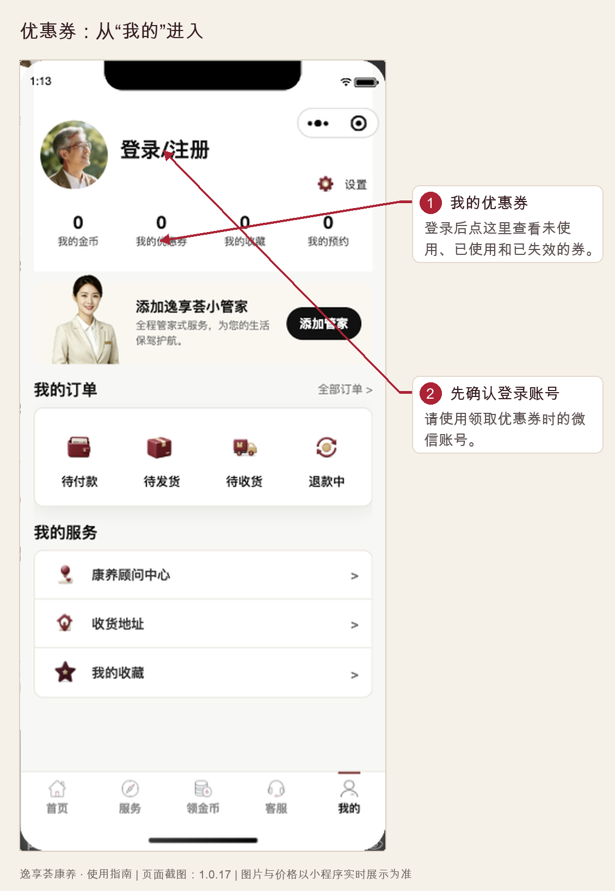

**领到券不代表每种服务都能用。** 没有显示优惠抵扣的订单，不要默认已经使用优惠券；也不要为用券去购买尚未开放的商品。适用范围有疑问时，先咨询客服再支付。

## 收藏与分享

1. 在旅居、课程或活动详情中，点击爱心“收藏”；再次点击可取消。
2. 已收藏的内容可在“我的 → 我的收藏”中找回，点击卡片返回详情；也可在收藏列表中取消收藏。
3. 想让家人或朋友一起看，点击详情底部“分享”，在微信中选择好友或群。

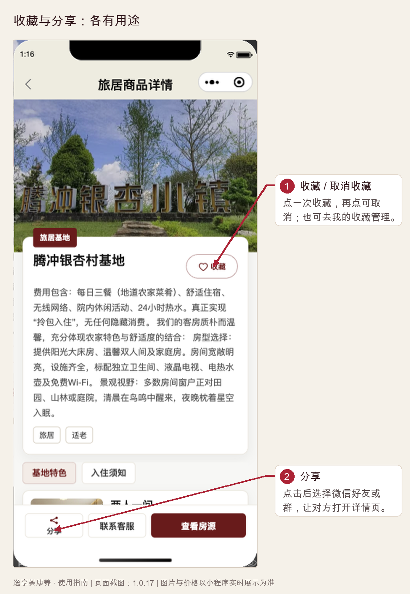

**收藏只方便找回内容，不保留名额、房间或价格。** 分享详情也不等于替对方报名或付款。

## 签到领金币

1. 点击底部“领金币”，登录后查看金币数量和连续签到天数。
2. 点击“立即签到”，等到签到成功提示；当天完成后会显示“今日已签到”。
3. 查看“做任务 赚金币”，按页面说明参与邀请等任务。

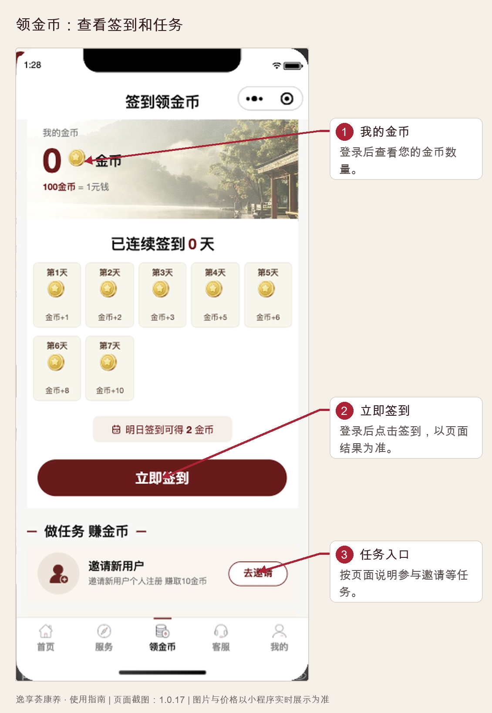

奖励和抵扣条件以页面实时规则为准。金币不等于可直接提现的现金，也不代表所有订单都支持抵扣。

## 联系客服与添加管家

### 从“客服”进入

1. 点击底部“客服”，查看当前在线时间。
2. 点击小程序中的群二维码区域，按微信提示进入群聊。
3. 需要一对一咨询，可点击客服卡片的“添加微信”；也可点“复制微信号”，再到微信“添加朋友”粘贴搜索。

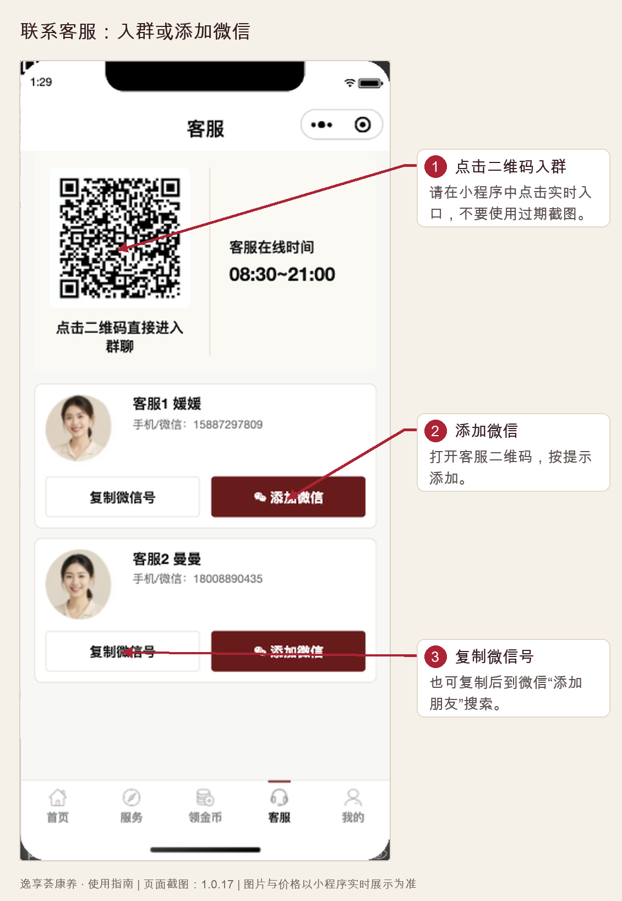

### 从首页添加管家

在首页“添加逸享荟小管家”区域点“添加管家”，点击二维码放大后，长按识别或保存，再用微信扫一扫。

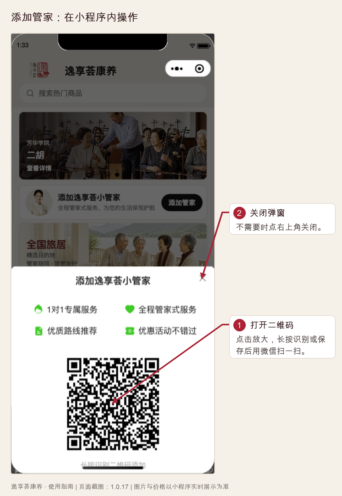

**请以小程序内最新二维码为准，不要长期保存本指南中的二维码使用。** 咨询订单问题时，可提供订单号、项目名称、问题发生时间及已遮挡隐私的截图；不要提供支付密码、短信验证码或完整身份证照片。

## 个人资料与收货地址

**修改个人资料：** 登录后进入“我的 → 设置”，点击顶部个人资料区域，按页面提示修改头像、昵称等资料。需要退出当前账号时，在设置中选择“退出登录”，确认后操作。

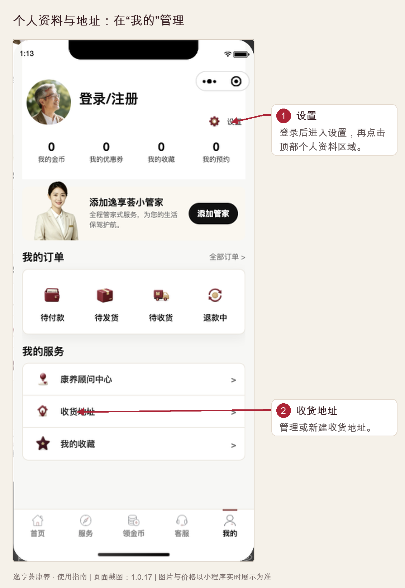

**新建地址：** 进入“我的 → 收货地址 → 新建收货地址”，填写姓名、手机号、所在地区和详细地址；需要时设为默认地址，最后点击“保存”。已有地址可点击进入修改。

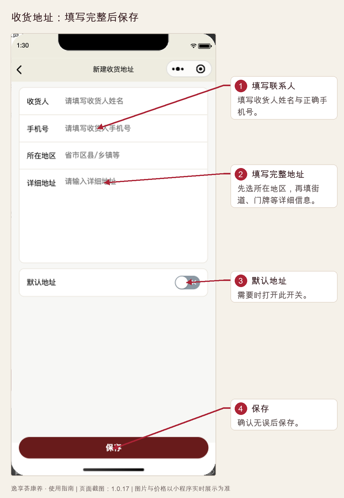

旅居和活动的联系人填写在对应预订或报名页面中；修改收货地址不能代替修改已提交订单的联系人。

## 云南好物的当前状态

首页“云南好物”会进入服务页对应栏目。目前显示“板块正在准备中，敬请期待”，暂不开放商品浏览和购买，也不会在首页推荐或全局搜索中展示相关商品。“我的”中目前没有购物车入口。

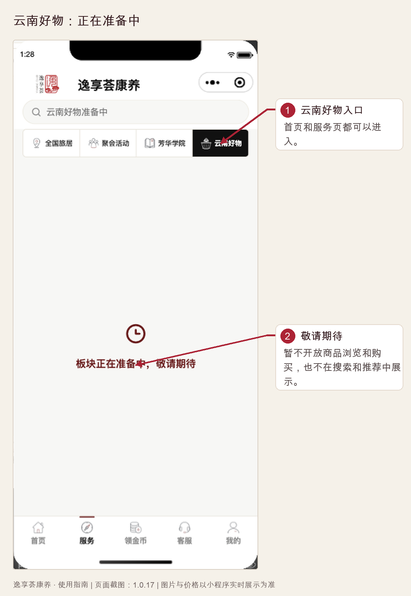

## 常见问题 FAQ

**1. 为什么登录按钮点不动？** 先阅读并勾选用户协议和隐私政策。若提示登录中，请稍等；网络异常时退出页面后重试。

**2. 不授权手机号能使用吗？** 可以选择“暂不授权”完成相应登录流程。预订或报名需要联系您时，仍需填写有效手机号。

**3. 为什么看不到之前的订单、优惠券或收藏？** 先确认登录的是原来的微信账号，再检查订单状态筛选、优惠券分类。仍找不到时联系客服，不要直接重复下单。

**4. 为什么搜索不到云南好物？** 该栏目仍在准备中，当前主动不展示商品，也不参与搜索和推荐，并非输入方法有误。

**5. 搜索其他内容没有结果怎么办？** 减少关键词、检查错别字，或从“服务”按城市和分类查找。若显示“搜索服务暂不可用”，请稍后重试。

**6. 旅居页面的“每人每晚价”就是总价吗？** 不是。总额与房型、天数、房间数量及供餐选择有关，请看预定信息中的费用明细和收银台金额。

**7. 旅居日期为什么不能任意选择？** 固定套餐的入住晚数需与套餐一致。只有提供“自选晚数”的房型才可按页面限制调整。

**8. 点了去付款或提交报名，就成功了吗？** 付费项目还需完成微信支付并确认订单状态。免费活动也要等到报名成功结果。

**9. 已扣款，但小程序仍显示待支付怎么办？** 先重新打开对应订单核对。仍不一致时，把订单号和微信支付记录提供给客服核查；遮挡无关隐私，不要重复付款。

**10. 活动报名后去哪里找齐齐老师？** 到“我的 → 我的预约 → 对应活动详情”查看二维码；首次成功报名后也会出现提示。

**11. 关闭报名成功弹窗后，二维码会丢失吗？** 不会。有效且成功的活动预约详情里仍可查看。日常重新打开预约，不需要再弹一次成功提示。

**12. 为什么预约里没有老师二维码？** 先检查是否还在待支付，或已经取消、退款。成功预约若二维码加载失败，可按页面提示重试，或从底部“客服”联系工作人员。

**13. 免费活动和付费活动的报名步骤一样吗？** 不完全一样。免费活动在确认框填写人数；付费活动需填写报名信息并完成付款。

**14. “已结束”的活动还能报名吗？** 不能。它们是往期内容；请回到可报名分类查看新活动。

**15. 课程报名后为什么在“我的预约”里找不到？** 请到“我的 → 全部订单”查课程报名订单。“我的预约”主要用于聚会活动。

**16. 每次打开都会送优惠券吗？** 不会。专属领券提示与指定入口、领取资格和活动状态有关；普通打开小程序不保证弹出。

**17. 已经领过券，还需要再次领取吗？** 通常不需要。先去“我的优惠券”检查是否到账；具体可领次数以该券规则为准。

**18. 有优惠券却用不了怎么办？** 检查是否已使用、已失效、未到使用时间、未满门槛，或不适用于该商品和订单类型。支付前确认抵扣确实出现在金额明细中。

**19. 收藏后能保留活动名额或房间吗？** 不能。收藏不是预约，名额、库存和价格以实际下单时为准。

**20. 怎么申请退款、何时到账？** 查看对应订单或预约提供的取消、售后操作，先阅读规则；不确定时联系客服。提交申请不等于退款完成，以处理状态和微信账单为准。

**21. 金币可以直接提现吗？** 不要把金币当作现金余额。用途、奖励和抵扣条件以当前页面规则为准；不保证每笔订单都能使用。

**22. 同一部手机怎么扫码加客服？** 优先在小程序里点击或长按二维码；也可保存图片，打开微信“扫一扫”，从相册选图识别。群聊入口则按页面提示直接点击。

**23. 二维码失效或图片加载不出来怎么办？** 重新进入小程序对应页面获取最新二维码；检查网络后重试。仍有问题时，可从“客服”复制微信号联系。

**24. 收货地址改了，已经提交的订单会跟着改吗？** 不要默认会同步。已提交订单的联系人、地址或预订信息如需变更，请进入该订单查看允许的操作，必要时联系客服确认。

---

遇到不确定的情况，先问客服、再确认付款。祝您在逸享荟找到合适的旅居、活动和课程。
